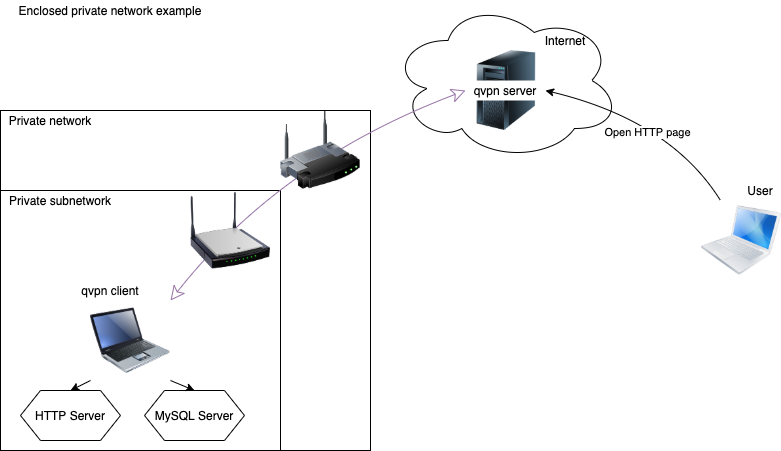

# Quasi VPN

VPN is a virtual private network. An extended private network through public network. 
QVPN client application allows you to expose some of services running in localnetwork to public via QVPN server.

On the example picture above, qvpn client is being run exposing HTTP server and MySQL server (just for demo). 
